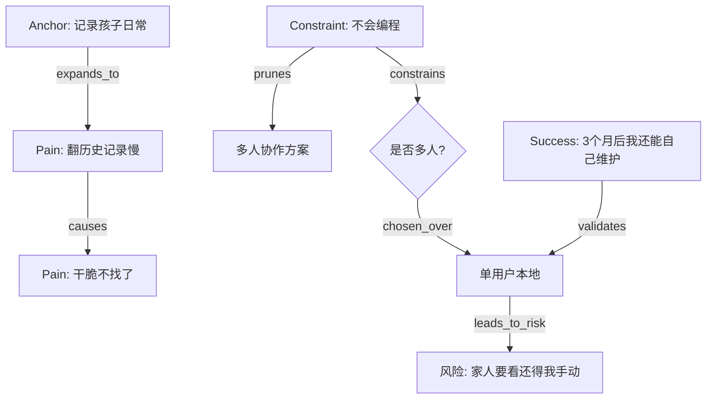

# vibe-unpack 知识图谱与追问维度设计（阶段 B）

**版本**: v0.1  
**日期**: 2026-07-29  
**前置**: 已完成阶段 A（核心原则与输出定义）  
**状态**: 草案

---

## 1. 目标

本阶段解决：
- 需求图谱的**节点类型**与**关系类型**精确定义
- 从支点出发的**6 个结构化展开维度**（问题簇）
- **闭合条件**（什么时候可以停止追问，认为需求已足够清晰）
- 分支决策点的**建模方式**（优缺点、选择依据如何落图）
- 图谱如何**映射**到阶段 A 定义的 Markdown 报告

---

## 2. 节点类型（Node Types）

所有节点必须有以下基础字段：

```json
{
  "id": "string (snake_case, 全局唯一)",
  "type": "Anchor | PainPoint | Constraint | Assumption | Alternative | SuccessCriterion | DecisionPoint | Risk | WorkaroundStep",
  "label": "人类可读短标签（≤60字）",
  "source": "user_quote | inferred | observed",
  "confidence": 0.0-1.0,
  "evidence": ["具体证据或用户原话片段"],
  "created_at": "ISO8601"
}
```

### 2.1 Anchor（锚点 / 支点）

**定义**：用户最初的模糊表达，或当前 workaround 的核心事实。

**示例**：
- "我想做一个像小红书但更简单的"
- "我现在用手机备忘录记录孩子每天的照片和视频"

**特点**：
- 通常是会话的起点（可以有多个，但至少一个）
- 后续所有节点都应能追溯到至少一个 Anchor

### 2.2 WorkaroundStep（当前 workaround 的步骤）

**定义**：用户现在解决问题时的**具体可执行步骤**。

**必须字段**：
- `step_order`: 数字
- `tool_used`: 具体工具名（"手机备忘录"、"朋友圈"、"Excel" 等）
- `time_cost`: 估算时间或心智成本
- `pain_level`: 1-5（如果这一步有痛）

**作用**：这是最重要的支点。很多后续痛点和约束都从这里长出来。

### 2.3 PainPoint（痛点）

**定义**：用户体验到的具体摩擦、崩溃时刻。

**必须字段**：
- `frequency`: "每天" | "每周几次" | "每月" | "偶尔"
- `severity`: 1-5
- `last_occurrence`: "上周三晚上..."（尽量具体）
- `user_quote`: 用户原话（越接近越好）

**反例**（不合格）：
- "太麻烦"（抽象）
- "用户体验不好"（AI 味）

**正例**（合格）：
- "上周我想找孩子3个月前的疫苗记录，翻了20分钟备忘录还是没找到"

### 2.4 Constraint（约束）

**定义**：限制技术/过程选择的硬性条件。

**分类建议**（作为 `constraint_category` 字段）：
- `time_budget`（时间）
- `skill_level`（用户能力）
- `maintenance_capacity`（维护意愿/能力）
- `data_sensitivity`（数据隐私/丢失容忍度）
- `offline_requirement`
- `multi_user`
- `deployment_environment`
- `budget`

**关键字段**：
- `hardness`: "hard" | "soft"
- `consequence_if_violated`: "如果违反，会导致..."

**示例**：
- "我完全不会编程，我认识的人里也没有会编程的"（hard）
- "我希望3个月后即使我不碰这个项目，它也能自己跑至少1年"（hard）

### 2.5 Assumption（隐性假设）

**定义**：用户自己未明确意识到的、却在驱动决策的信念。

**必须字段**：
- `risk_level`: "high" | "medium" | "low"
- `validation_method`: "问用户" | "找类似用户验证" | "技术可行性验证"

**示例**：
- "我假设所有数据都必须永久保存，不能丢"
- "我假设这个东西最终要给其他家长用（多人协作）"

### 2.6 Alternative（已有替代方案）

**定义**：用户已经尝试过、正在用、或明确拒绝的解决方案。

**字段**：
- `status`: "tried_and_rejected" | "currently_using" | "considered_but_not_tried"
- `why_rejected`: 简要原因

**作用**：防止重复造轮子，也能暴露未被满足的需求。

### 2.7 SuccessCriterion / FailureCriterion（成功/失败定义）

**定义**：3个月（或用户指定时间）后的可观测状态。

**示例（成功）**：
- "我每周至少用3次，而且不用我手动整理"
- "我妈妈也能用，不用我教"

**示例（失败）**：
- "我还是得手动复制粘贴"
- "三个月后我完全不管，程序就废了"

### 2.8 DecisionPoint（决策节点）

**定义**：一个需要做选择的关键问题，带有多个备选路径。

**必须字段**：
- `question`: "是否支持多人查看/编辑？"
- `options`: 数组，每个 option 至少有：
  - `id`
  - `label`
  - `pros`
  - `cons`
  - `constraint_alignment`: 哪些约束支持/反对这个选项
- `chosen_option_id`
- `rationale`: 选择依据
- `abandoned_cost`: 放弃其他选项的代价

**在图谱中的特殊地位**：
- DecisionPoint 是**分支的源头**
- 每条边 `chosen_over` 或 `pruned_by_constraint` 都应该连向 DecisionPoint

### 2.9 Risk（风险）

**定义**：如果某个假设/约束/决策出错，可能产生的负面后果。

**字段**：
- `likelihood`
- `impact`
- `mitigation`: 缓解措施（如果有）

---

## 3. 关系类型（Edge Types）

```json
{
  "source": "node_id",
  "target": "node_id",
  "relation": "string（见下表）",
  "confidence": 0.0-1.0,
  "evidence": "...",
  "weight": 1.0
}
```

### 3.1 核心关系表

| 关系 | 方向 | 含义 | 示例 |
|------|------|------|------|
| `anchors_from` | PainPoint → Anchor | 这个痛点源于该锚点 | 翻备忘录很慢 ← 我用备忘录记日常 |
| `expands_to` | Anchor → PainPoint | 从支点展开出的痛点 | 我用备忘录 → 翻历史记录慢 |
| `causes` | PainPoint → PainPoint | A 导致 B | 想找旧记录难 → 干脆不找了 |
| `mitigates` | WorkaroundStep → PainPoint | 当前 workaround 在缓解这个痛 | 按日期建文件夹 → 翻记录慢 |
| `constrains` | Constraint → DecisionPoint | 约束限制了这个决策 | 不会编程 → 不能选自建后端 |
| `prunes` | Constraint → Alternative | 约束直接淘汰了这个选项 | 3个月后可能不管 → 淘汰需要维护的方案 |
| `assumes` | Assumption → SuccessCriterion | 这个假设支撑了成功定义 | 假设数据不能丢 → 成功标准包含"永不丢数据" |
| `contradicts` | Assumption ↔ Constraint | 假设与约束冲突 | "数据不能丢" ↔ "我不会备份" |
| `chosen_over` | DecisionPoint → Alternative | 决策时这个选项胜出 | 选单用户 ← 多人协作被放弃 |
| `leads_to_risk` | DecisionPoint → Risk | 这个选择带来了风险 | 选纯本地存储 → 数据丢失风险 |
| `validates` | SuccessCriterion → PainPoint | 成功标准直接回应了这个痛点 | "每周用3次" 回应 "现在记完就忘" |
| `replaces` | Alternative → WorkaroundStep | 这个替代方案试图替换当前 workaround | 小红书试图替换手机备忘录 |

**关系命名原则**：
- 尽量用**动词**，方向从语义上自然
- `prunes` 和 `chosen_over` 是两个最重要、必须高频使用的关系（体现约束驱动的裁剪）

---

## 4. 六大展开维度（从支点出发的问题簇）

这是 `vibe-unpack` 的核心追问引擎。

从任何一个 Anchor / WorkaroundStep 出发，系统性地往以下6个方向展开：

### 维度 1: 用户场景（Context）

**问题簇**：
- 谁在使用？（用户本人？家人？朋友？陌生人？）
- 什么设备？（手机？电脑？平板？）
- 什么场景/时间？（通勤？晚上？工作间隙？）
- 频率？（每天？每周？事件驱动？）
- 环境限制？（网络？离线？多设备？）

**产出节点类型**：Anchor 的扩展、Constraint（offline、multi_device 等）

### 维度 2: 痛点图（Pain）

**问题簇**：
- 过去1个月，哪3个瞬间最崩溃？
- 每个崩溃时刻具体发生了什么？
- 这个问题重复出现了多少次？
- 如果这个问题消失了，生活/工作会发生什么变化？

**产出节点类型**：PainPoint（必须具体）

### 维度 3: 约束边界（Constraints）

**问题簇**：
- 如果这个项目只能活3个月，哪3个功能必须完美运行？
- 3个月后你可能完全不碰这个项目了吗？如果是，它需要自己能跑多久？
- 你或你认识的人中，有谁会编程？如果完全没有，我们的技术选型必须限制在"StackOverflow 直接能搜到答案"的范围内。
- 你对数据丢失的容忍度是多少？（永远不能丢 / 丢了可以重新记 / 丢了也没关系）
- 你愿意为这个东西投入多少时间/金钱？（每周1小时？一次性200块？）

**产出节点类型**：Constraint（高优先级）

### 维度 4: 隐性假设（Assumptions）

**问题簇**：
- 你刚才说"数据不能丢"——如果真的丢了，最坏的结果是什么？用户会怎么做？
- 你假设最终会有其他人用吗？还是只给自己用？
- 你假设这个东西需要"一直在线"吗？
- 你假设内容需要被搜索/被整理吗？
- 如果"像小红书"这个比喻去掉，你真正想要的核心功能是什么？

**产出节点类型**：Assumption + 可能的 Contradiction 边

### 维度 5: 竞争与替代（Alternatives）

**问题簇**：
- 你现在用什么解决这个问题？（已覆盖）
- 你以前试过什么？为什么放弃了？
- 你周围的人是怎么解决类似问题的？
- 你为什么不直接用 XXX（用户提到过的工具）？
- 如果什么都不做，3个月后会怎样？

**产出节点类型**：Alternative + WorkaroundStep

### 维度 6: 成功/失败定义（Termination）

**问题簇**：
- 3个月后，什么情况算"这项目有意义"？
- 什么情况算"白做了"？
- 你最不能妥协的1-2个点是什么？
- 如果只能保留1个功能，你会保留哪个？
- 你愿意为了这个东西忍受多大的不完美？

**产出节点类型**：SuccessCriterion / FailureCriterion

---

## 5. 闭合条件（Closure Criteria）

什么时候可以认为"需求已经足够清晰，可以停止追问"？

### 5.1 最小闭合标准（必须全部满足）

1. **至少1个 Anchor + 完整 WorkaroundStep 链**
   - 当前 workaround 的步骤被完整记录（≥3步或覆盖主要流程）

2. **PainPoints 覆盖主要崩溃场景**
   - 至少3个具体 PainPoint，且至少1个有 "last_occurrence" 具体时间

3. **硬约束至少覆盖3类**
   - 必须包括：skill_level、maintenance_capacity、data_sensitivity 中的至少2个

4. **至少1个有真实权衡的 DecisionPoint**
   - 不能只是"要不要做"，而是"在A和B之间选"

5. **Success/Failure Criteria 明确**
   - 至少1条成功标准 + 1条失败标准，且是可观测的

### 5.2 推荐闭合标准（理想状态）

- 6个维度中至少4个有≥2个节点
- 至少2个 Assumption 被显性化
- 至少2个 Alternative 被记录 + 拒绝理由
- 至少1个 Assumption ↔ Constraint 的矛盾边被发现
- 下一步行动（Immediate Next Steps）具体到可执行动作

### 5.3 强制停止信号（无论是否闭合都要停）

- 用户明确说"我不想再聊这个了"
- 连续3轮追问都得到"我不知道"或重复性回答
- 总问题数超过15个（单次会话）
- 会话时长超过45分钟

**策略**：宁可输出"部分闭合 + 风险标注"，也不要无限追问。

---

## 6. 分支决策的图谱表示（Decision Modeling）

### 6.1 一个 DecisionPoint 在图中的典型形态

```
                ┌─────────────────────────┐
                │ DecisionPoint           │
                │ "是否支持多人协作？"      │
                └────────────┬────────────┘
                             │
            ┌────────────────┼────────────────┐
            ▼                ▼                ▼
    ┌──────────────┐  ┌──────────────┐  ┌──────────────┐
    │ Alternative  │  │ chosen_over  │  │ Alternative  │
    │ "多人协作"    │◀─┤ (chosen)     │  │ "单用户"      │
    │ pros: ...    │  │              │  │ pros: ...    │
    │ cons: ...    │  │              │  │ cons: ...    │
    └──────┬───────┘  └──────────────┘  └──────┬───────┘
           │                                   │
           │ prunes (Constraint: "不会编程")   │
           ▼                                   ▼
    ┌──────────────┐                    ┌──────────────┐
    │ Risk         │                    │ Success      │
    │ "复杂度爆炸"  │                    │ "我能自己维护"│
    └──────────────┘                    └──────────────┘
```

### 6.2 关键边语义

- `chosen_over`：从 DecisionPoint 指向被**选中**的 Alternative（或反向）
- `prunes`：从 Constraint 指向被**直接淘汰**的 Alternative / 路径
- `leads_to_risk`：从被选中的路径指向它引入的 Risk
- `supports`：从 Constraint 指向支持选中路径的理由

---

## 7. 双格式输出映射

### 7.1 图谱 → Markdown 的对应关系

| 图谱元素 | 对应 Markdown 章节 |
|----------|-------------------|
| Anchor + WorkaroundStep | 第1章 "当前状态" |
| PainPoint 节点 + causes 边 | 第2章 "痛点地图" |
| Constraint 节点 | 第3章 "约束账本"（按 category 分组） |
| Assumption 节点 + contradicts 边 | 第4章 "隐性假设与风险" |
| SuccessCriterion / FailureCriterion | 第5章 "成功与失败定义" |
| DecisionPoint + 所有相关边 | 第7章 "决策日志"（每节点一节） |
| 所有 "Immediate Next Steps" | 第8章（人工或规则生成） |

### 7.2 图谱必须额外携带（仅图谱有，Markdown 精简）

- 展开顺序（temporal order of discovery）
- 哪些节点是"推断"（inferred）而非用户直说
- 剪枝路径（被 prunes 的边）
- 矛盾对（contradicts）

这些信息对人类理解"为什么走到这里"非常关键，但 Markdown 报告中可以简写。

---

## 8. 一个小规模示例（节选）

**用户原话**：我想做一个像小红书但更简单的，记录我和孩子的日常。

**Anchor**:
- id: anchor_001
- label: "记录我和孩子的日常，想像小红书但更简单"

**WorkaroundStep**:
- step1: 用手机备忘录拍照/视频
- step2: 偶尔想找历史记录时手动翻
- step3: 想给奶奶看就截图发微信

**PainPoint**:
- id: pain_001
- label: "想找3个月前的疫苗记录，翻了20分钟没找到"
- frequency: "每月几次"
- severity: 4
- last_occurrence: "上周三晚上10点"

**Constraint**:
- id: const_001
- label: "我不会编程，我和朋友都不会"
- category: skill_level
- hardness: hard

**DecisionPoint**:
- id: decision_001
- question: "要不要支持多人查看？"
- options:
  - "多人（奶奶、妈妈都能看)"
    - pros: "家人能参与"
    - cons: "需要账号、权限、同步"
    - constraint_alignment: "被 const_001 强烈反对"
  - "单用户（只有我自己用）"
    - pros: "极简，可用纯本地实现"
    - cons: "奶奶要看还得我手动发"
    - chosen: true
- rationale: "我现在连自己能不能长期维护都不确定，先做到自己能用再说"
- abandoned_cost: "短期内家人参与会比较麻烦"

**图谱片段（Mermaid 示例，供人类阅读）**：



---

## 9. 阶段 B 完成标志

- 节点类型定义完整（含必填字段）
- 关系类型表完整（含方向与语义）
- 6大维度的问题簇可直接用于追问
- 闭合条件可操作（最小 + 推荐 + 强制停止）
- 决策建模方式有清晰的图表示例
- 映射关系明确（图谱 ↔ Markdown）

---

**下一步（阶段 C）**：基于本阶段的 schema，设计 4-6 个典型的压力场景（普通人模糊输入），用于后续 TDD 验证。

---

*此文档与阶段 A 一起，构成 vibe-unpack 的设计基线。*
