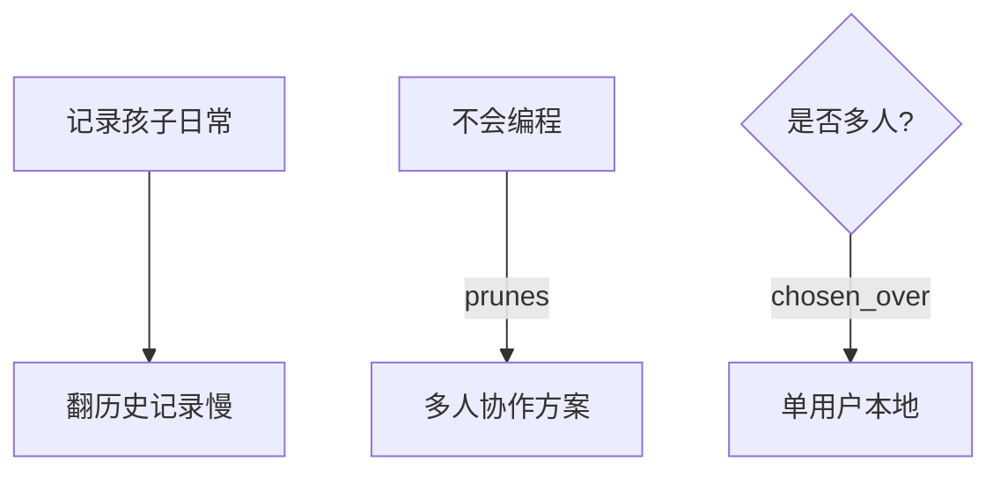

# vibe-unpack

> 把普通人脑子里的模糊感觉，变成清晰、可执行、可验证的需求。

**vibe-unpack** 是一个专为**完全非技术用户**设计的「需求解包器」。它通过结构化的追问，把「我想做一个像小红书但更简单的」「给手作店做一个网站」这类只有感觉、场景、情绪的模糊输入，一步步展开成带有硬约束、决策权衡、成功/失败定义的完整需求规格书 + 知识图。

**核心理念**：在写一行代码、推荐一个技术栈、匹配一个技能之前，先把需求真正搞清楚。

> **重要说明（关于名字）**：  
> 我们**故意没有在项目名和 skill 名里加 "skill"**。  
> `vibe-unpack` **会被当作 Claude Code Skill 加载**（把整个目录复制到 `~/.claude/skills/vibe-unpack`），但它的角色是**上游需求管理者（Manager）**，而不是执行层 skill。  
> 它绝不生成代码、脚本、内容、生产流程，也不做术语润色或任务拆解。名字里的 "unpack" 就是它唯一要做的事——把模糊彻底拆开。

**与其它同类工具的定位差异**（请务必理解）：
- **不是 khazix leader**：我们只做需求解包，不写可执行任务书、不分配子任务、不设计验收标准。
- **不是 vibe-hub**：我们不做术语提升、不把口语改成专业术语，我们只挖约束和决策。
- **不是任何执行层 skill**（rnskill、canghe、huashu 等）：我们绝不产生代码、内容创作流程、视频剪辑等。
- **我们的唯一产出**：冻结的需求规格（`demand-spec.md` + `demand-graph.json`） + 可选可视化（Mermaid）。

如果你在使用过程中开始想“这个可以用 XX 实现”或“后面可以加功能”，请立即停下来——那不是 vibe-unpack 的工作。

---

## 它解决了什么问题？

普通人表达需求时通常只有：
- 一种感觉（"我想记录孩子日常，但不要太复杂"）
- 一个场景（"给我的手作店做一个网站"）
- 一种情绪（"现在的工具都太烦人了"）

而真正的需求是：
- 硬约束（"我完全不会编程，3个月后可能就不管了"）
- 隐性假设（"我以为要像小红书一样，其实我只需要自己能快速翻到旧记录"）
- 权衡决策（"多人协作 vs 极简维护，我选极简"）
- 成功定义（"3个月后我还能自己维护，奶奶能自己看到内容"）

**vibe-unpack 就是把前者变成后者**。

---

## 核心铁律（永远不会越界）

- ✅ 永远不推荐任何技术栈、框架、数据库
- ✅ 永远不匹配、推荐、筛选任何 skill
- ✅ 永远把「当前 workaround」作为唯一支点
- ✅ 痛点必须具体到「上周三晚上 10 点翻了 20 分钟」
- ✅ 输出必须同时服务**人类**（可视化图）和**AI**（结构化 JSON + Markdown）

---

## 真实案例（6 个压力场景）

我们用 6 个典型场景完整跑通了流程，每一个都产出了可直接阅读的成果：

| 场景 | 用户初始输入 | 关键发现 | 推荐路径 |
|------|--------------|----------|----------|
| [C1 孩子日常](examples/c1-child-daily) | 像小红书但更简单，记录孩子日常 | 完全不会编程 + 奶奶只会微信 + 可能 3 个月不管 | 先手动整理 + 极简本地方案 |
| [C2 记账](examples/c2-accounting) | 做一个简单的记账 App，不要像现有软件那么复杂 | Excel 已经有了，真正痛点是分类太细 + 月底对账 | 先把 Excel 砍成 4-5 个粗分类，验证 1 个月 |
| [C3 手作店](examples/c3-handmade-shop) | 给小手作店做一个清爽网站 | 每天被 5-10 个重复私信打扰才是最大痛 | 先做自动回复验证客服减负，再考虑 no-code |
| [C4 健身](examples/c4-fitness) | 记录健身 + 进度曲线激励自己 | 技术能力强但执行力低，复杂工具会更早放弃 | 先用备忘录验证 2 周，再做极简一行输入工具 |
| [C5 家庭相册](examples/c5-family-album) | 家庭相册共享，不想用微信 | 奶奶只会微信，技术能力完全不对称 | 混合方案：奶奶看精选推送 + 自己本地完整存档 |
| [C6 小说游戏](examples/c6-novel-game) | 把故事做成像原神一样的游戏 | 零编程 + 零美术 + 零预算 + 对复杂度严重低估 | 强制从纯文字 Twine 开始，永远不要从 Unity 开始 |

每个案例都包含：
- `demand-spec.md` —— 人类可读的完整需求规格书
- `demand-graph.json` —— AI 可消费的结构化知识图
- `demand-graph.mmd` —— Mermaid 可视化分支与剪枝图
- `README.md` —— 案例解读

---

## 输出是什么样子？

以 C1（记录孩子日常）为例，普通妈妈最初只说了一句话：

> 我想做一个像小红书但更简单的 App，专门记录我和孩子的日常。

经过引导后产出（节选）：

**约束账本（最致命部分）**：
- 完全不会编程，身边也没有会技术的人 → 任何需要自己维护的方案都死
- 可能 3-6 个月后就不管了 → 必须能自己跑至少半年
- 奶奶只会用微信，技术能力极低 → 再酷的 App 对她也是零价值

**关键决策**：
- 多人协作 vs 极简个人 → 选极简（被「不会编程 + 奶奶不会用」直接剪掉）
- 云端 vs 本地 → 倾向本地（至少前 3 个月先验证）

**下一步行动**（具体可执行）：
1. 本周内把过去 3 个月的内容用固定格式整理一次
2. 找奶奶和老公直接看整理后的内容，观察他们能不能自主操作
3. 两周后自问：如果 3 个月我不管，这个东西还能不能自己用？

**可视化效果**（Mermaid）：



完整的图见 [examples/c1-child-daily/demand-graph.mmd](examples/c1-child-daily/demand-graph.mmd)。

---

## 安装与使用

### 作为 Claude Code Skill（推荐）

```bash
cp -r vibe-unpack ~/.claude/skills/vibe-unpack
```

之后在对话中遇到模糊需求时，Claude Code 会自动加载 `SKILL.md`。

**关于名字的说明**：
虽然我们把整个目录复制到了 `~/.claude/skills/vibe-unpack`，**项目名和 skill 名都故意不带 "skill"**。
这是刻意设计。vibe-unpack **会被当作 skill 加载**，但它的角色是**上游需求管理者（Manager）**，而不是执行型 skill。它不会写代码、不会做内容、不会拆任务。

### 手动使用（任何支持 SKILL.md 的 Agent）

直接把 `vibe-unpack/SKILL.md` 的全部内容作为 system prompt 喂给模型，然后把用户的模糊描述扔进去即可。

### 自己扮演解包器

严格按照 `SKILL.md` 里的全部规则（铁律、六大维度、防范腐烂机制、输出前自检清单、法 vs 情报区分）去追问，最后手动整理输出。

---

## 设计原则

1. **模糊是常态，不是异常**
2. **当前 workaround 是唯一支点**
3. **约束永远比功能重要**
4. **分支和剪枝必须可视化**（人类要看到「为什么走到这里」）
5. **输出必须双格式**（人类看图 + AI 看结构化数据）

完整原则见 [design-A-core-principles.md](design/design-A-core-principles.md)。

---

## 项目结构

```
vibe-unpack/
├── SKILL.md                    # 核心规则（可直接作为 system prompt 使用）
├── README.md                   # 本文件
├── design/
│   ├── design-A-core-principles.md   # 核心原则
│   ├── design-B-graph-schema.md      # 图谱 schema + 六大维度
│   └── design-C-pressure-scenarios.md # 6 个压力场景设计
├── examples/                   # 6 个完整真实案例（每个含 demand-spec + graph + mmd + README）
│   ├── c1-child-daily/         # 记录孩子日常（最经典案例）
│   ├── c2-accounting/          # 极简记账
│   ├── c3-handmade-shop/       # 手作店网站
│   ├── c4-fitness/             # 健身打卡
│   ├── c5-family-album/        # 家庭相册
│   └── c6-novel-game/          # 小说做游戏（野心与能力冲突）
├── scripts/                    # 辅助脚本
└── templates/                  # 输出模板（可选）
```

---

## 状态与路线图

**当前状态**（2026-07-31 更新后）：
- ✅ 核心规则与边界已大幅强化（基于 khazix-skills leader、vibe-hub-skill、rnskill 等 7 个参考项目的深入分析）
- ✅ 输出合同极度克制 + 主动防腐烂机制已落地
- ✅ 6 个完整真实压力场景已验证（虽示例输出格式暂未全部升级到最新模板）
- ✅ SKILL.md 可直接作为 system prompt 或 Claude Code Skill 使用
- ✅ 本地已部署到 `~/.claude/skills/vibe-unpack`

**已完成的核心能力**：
- 把模糊输入结构化拆解为可验证的需求
- 主动检测并记录空转语言、无法证伪的成功定义、隐性范围爆炸、维护谎报
- 显性化所有「已确认的假设与默认决策」
- 强制输出极简（只给三样东西）
- 区分「法（必须遵守）」和「情报（可灵活调整）」
- 输出前自检清单（闭合性、腐烂风险、默认决策、边界、格式）

**后续可能**（非优先）：
- 把 6 个示例全部更新为最新模板格式（含第 6 节「已确认的假设与默认决策」）
- 自动化生成 Mermaid / HTML 可视化
- 更多领域案例
- 与现有执行型 skill 的接力流程文档
- 可选的「技能匹配」独立 skill（不会放在本项目）

---

## 贡献

目前是个人项目，欢迎通过 issue 或 PR 提供：
- 新的真实模糊需求案例（越模糊越好）
- 对现有案例的反馈
- 可视化工具

---

**一句话总结**：

在你冲动地说「我要做一个 App」之前，先让 vibe-unpack 帮你把「为什么要做」「能不能做」「做了之后会死在哪」这三件事彻底搞清楚。

现在，打开 [examples/c1-child-daily/demand-spec.md](examples/c1-child-daily/demand-spec.md) 开始体验吧。
